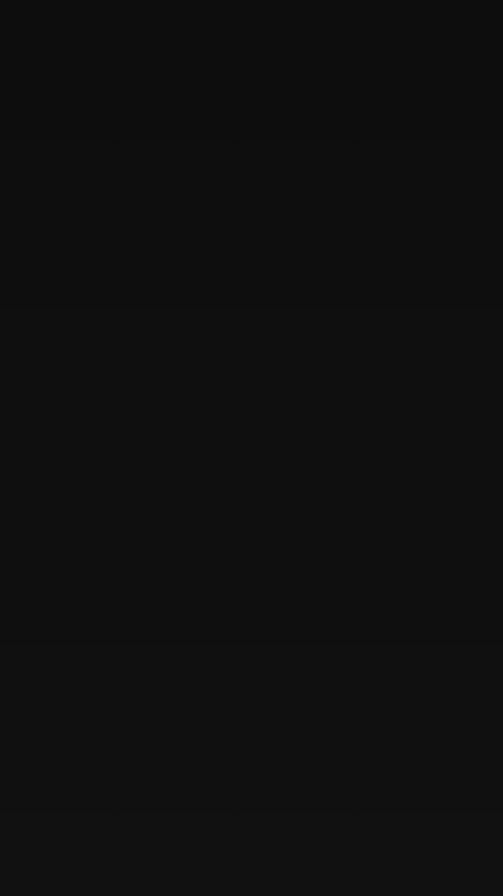
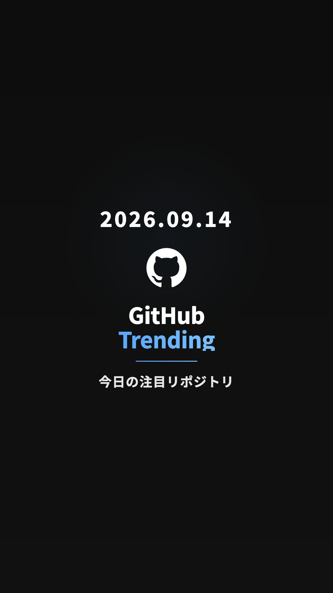
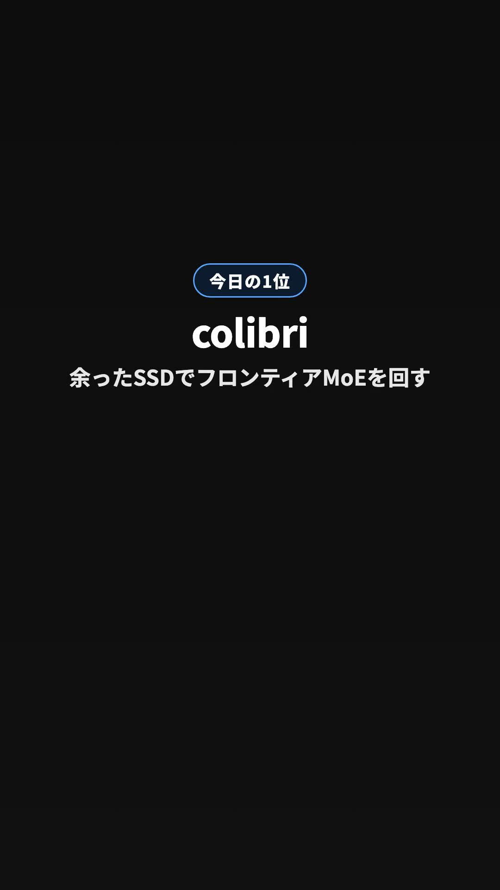
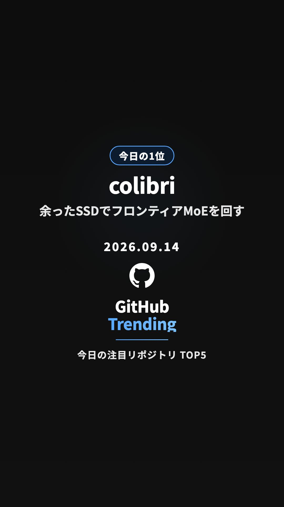

# YouTube 配信実験 — タイトル / 説明文 / 冒頭フレームの日替わり個別化（2026-09-14）

判定レポート（14 日比較表・判定・次の一手）は sns-hub 側
`docs/pdca/experiments/2026-09-14-yt-title-individualization.md` に置く。本書は実装メモ。

## 背景

- 同じ動画が Instagram Reels では中央値 900〜1,300 views、YouTube Shorts では 0〜1 views
  （直近 14 日 n=13: YT median 0 / IG median 907）。内容は IG で証明済み。
- YouTube は 2026-04-21 に 213 → 9 views へ一夜で落ち、以後回復なし。
- 4 月以降の全 82 本が同一タイトル `【GitHub Trending】今日の注目リポジトリ TOP5｜YYYY/MM/DD #Shorts`、
  同一の説明文テンプレ、冒頭フレームも日付以外は同一（= 自動サムネも毎日同じ絵）。
- YouTube の公式ポリシーは「テンプレで作ったように見える」「最小限の差分で量産」を明示的に対象にしている
  （収益化ポリシー「inauthentic content（旧 repetitious content）」、スパムポリシー「Automated or synthetic mass-production」）。
  審査はタイトル・サムネ・説明文などのメタデータも見る。トリガーは投稿手段（API）ではなく中身の同一性。
- 直近 3 本（09-11 / 09-13 / 09-14）は oEmbed が 200 = 公開状態（API 未審査プロジェクトによる非公開ロックではない）。

## 仮説

YouTube 側だけに見える「同一メタデータ + 同一冒頭画の毎日連投」が再利用 / 量産判定を招いている。
メタデータと冒頭画を日替わりにすれば配信が戻る。戻らなければ原因は形式そのもの（次の一手 = YouTube のみジャンル / 型を変える）。

## 設計の要点: Instagram は 1 バイトも変えない

動画はこれまで IG と YouTube の共用 1 本だった。IG は当たっている（= 触らない）うえに、この実験の**対照群**でもあるので、
冒頭画の変更は**YouTube 専用の 2 本目のレンダ**に入れた。

```
output/trending-YYYYMMDD.mp4                共用レンダ → Instagram / GitHub Release（従来どおり・無変更）
output/trending-YYYYMMDD-cover.jpg          共用 cover → GitHub Release（従来どおり・無変更）
output/trending-YYYYMMDD-youtube.mp4        openingVariant="top1" の専用レンダ → YouTube
output/trending-YYYYMMDD-youtube-cover.jpg  専用レンダの frame 60 → YouTube サムネ（ベストエフォート）
```

専用レンダが失敗 / 時間切れなら、YouTube は共用動画を投稿する（毎朝の投稿は止めない）。時間予算はパイプライン開始から 10 分
（ジョブの timeout を 15 → 20 分に延長。通常日は開始 ~4 分で専用レンダまで終わる）。残りが 150 秒未満なら始めず、各工程も残り時間で打ち切る。
打ち切りは**プロセスグループごと**（`scripts/process-group.mjs`: detached で起動し、SIGTERM → 猶予 5 秒 → SIGKILL をグループ全体へ）。
npx の下の remotion / ffmpeg が生き残ってステップの stdout を握り、ジョブ上限まで止まる（= 履歴コミットが飛ぶ）ことはない。
これで IG 投稿（処理待ち最大 5 分）の時間は常に確保される。

## 変更点（YouTube 投稿部分のみ）

| # | 変更 | ファイル |
|---|---|---|
| A-1 | タイトルを `TOP1名 — 何ができるか｜GitHub Trending TOP5 M/D` に（95 文字セーフ上限、`<>`・制御文字・ゼロ幅文字を除去） | `scripts/youtube-caption.mjs`, `scripts/generate-caption.mjs` |
| A-2 | 説明文を TOP1 リード + 各リポの detail 文 + 顔ぶれ行に（固定の冒頭文・CTA 文を廃止、5000 バイト上限へ自動収束） | 同上 |
| A-3 | 実験腕は Variable で固定（`optimization-hints.json` の recommendedTitleTemplate は無視してログのみ）。`standard` は**旧タイトル + 旧説明文**を完全再現（origin/main 出力とのゴールデンテスト） | `scripts/youtube-caption.mjs`, `scripts/generate-caption.test.mjs` |
| A-4 | `performance-history.json` に実際に投稿した腕を記録: `titleTemplate` / `ytOpening`（top1 or brand）/ `ytThumbnail`（set / skipped:… / error:…） | `scripts/record-upload.mjs`, `scripts/upload-youtube.mjs` |
| A-5 | YouTube が新タイトル / 説明文を拒否（`invalidTitle` / `invalidDescription` / `invalidVideoMetadata`）したら、旧メタデータで 1 回だけ再アップロード（実験でその日の投稿を失わない）。拒否理由は `err.response.data.error.errors[].reason` から読む（gaxios 7 は `err.errors` を設定しない）。タイトル長は UTF-16 単位で数える | `scripts/youtube-upload.mjs`, `scripts/upload-youtube.mjs`, `scripts/youtube-caption.mjs` |
| B-1 | YouTube 専用レンダ: 同じ props + `openingVariant="top1"`。frame 0 から「今日の1位」ピル + TOP1 名 + 一行フック（最大 3 行で省略）。共用 `<Opening />` は origin/main とバイト同一。時間予算つき（プロセスグループごと打ち切り）・失敗時は共用動画へ | `src/components/OpeningTop1.tsx`, `src/compositions/TrendingVideo.tsx`, `scripts/pipeline.mjs`（Step 4d）, `scripts/youtube-variant.mjs`, `scripts/process-group.mjs` |
| B-2 | 専用レンダの frame 60 を `thumbnails.set`（非ブロッキング・30 秒で打ち切り・ベストエフォート）。`upload-result.json` はその前（insert 直後）に書く | `scripts/upload-youtube.mjs`, `scripts/post-sns.mjs` |
| D | 14 日比較表ジェネレータ（control / treatment の YT・IG views、中央値、判定）。未取得の YT stats（`updatedAt: null` の仮 0）は数えない。判定は 暫定 → 14 日判定 → 年齢を揃えた確定 の 3 段階 | `scripts/yt-experiment-report.mjs` |
| 検証 | `workflow_dispatch` に `dry_run`（両動画をレンダして artifact に上げるだけ。投稿・履歴コミットなし）。ジョブ timeout 15 → 20 分 | `.github/workflows/daily-video.yml` |

### ビフォー / アフター（2026-09-14 の実データで生成）

**タイトル**

- Before: `【GitHub Trending】今日の注目リポジトリ TOP5｜2026/09/14 #Shorts`（82 本すべて日付以外同一）
- After: `colibri — 余ったSSDでフロンティアMoEを回す｜GitHub Trending TOP5 9/14`（55 文字）
- 別の日の例（TOP1 が変わればタイトルも変わる）: `ever-gauzy — 小規模チーム向け統合業務OSS｜GitHub Trending TOP5 9/15`
- `#Shorts` はタイトルから外した。Shorts 判定は「縦長 or 正方形 + 3 分以内」で決まり、ハッシュタグは要件ではない（説明文のハッシュタグには残る）。

**説明文（冒頭）**

- Before: `2026/09/14 の GitHub Trending 上位5リポジトリを紹介します。` + 1 行 description のリスト + 固定 CTA 2 行
- After（2,438 バイト / 上限 5,000。超過時は detail 行を落とした短形式に自動切替）:
  ```
  今日のTOP1は colibri（JustVugg/colibri）— 余ったSSDでフロンティアMoEを回す。
  VRAMとRAMとNVMe SSDを一つのメモリ階層と見なす純C推論エンジン。routed MoEを19MB単位で…

  2026/09/14 の GitHub Trending TOP5

  1. JustVugg/colibri — 余ったSSDでフロンティアMoEを回す
     VRAMとRAMとNVMe SSDを一つのメモリ階層と見なす純C推論エンジン。…
     29,690 stars (+960 today) / C
     https://github.com/JustVugg/colibri
  …（5 本）
  今日の顔ぶれ: colibri / ever-gauzy / gods-eye-view / agent-skills / DeskcommCRM

  #GitHubTrending #GitHub … #Shorts
  ```

**冒頭フレーム**

| | frame 0（最初の 1 枚） | frame 60（= YouTube サムネ候補） |
|---|---|---|
| Before = 共用レンダ（IG は今後もこのまま） |  |  |
| After = YouTube 専用レンダ |  |  |

After の frame 0 は実際にエンコードされた `trending-20260914-youtube.mp4` の先頭フレームを抜き出したもの。

### 変更していないもの

- Instagram: 動画ファイル（共用レンダ）、`generateInstagramCaption`、`upload-instagram.mjs`、thumb_offset、GitHub Release のアセット名
- YouTube: `privacyStatus=public` / `madeForKids=false` / `categoryId=28` / `defaultLanguage=ja`
- 動画の構成（Opening → 5 カード → Ending）、ナレーション、BGM、投稿時刻（08:00 JST）
- `post-today-instagram.yml`（Release の `trending-${DATE}.mp4` を取得する再投稿経路）

## キルスイッチ（コード変更なしで戻せる）

GitHub repo **Variables**（Settings → Secrets and variables → Actions → Variables）:

| Variable | 値 | 効果 |
|---|---|---|
| `YT_TITLE_TEMPLATE` | `standard`（or `false`） | 旧タイトル + 旧説明文に戻す |
| `YT_OPENING_HOOK` | `false` | YouTube 専用レンダをやめ、YouTube にも共用動画を投稿（ジョブ時間も元に戻る） |
| `YT_SET_THUMBNAIL` | `false` | `thumbnails.set` をスキップ |

未設定（または `true`）= 実験腕。**認識できない値（打ち間違い）は「実験前の動き」側に倒し、警告をログに出す**（例外で投稿を止めない）。
ローカル実行時は同名の環境変数。

## 検証

### ローカル（2026-09-14、SNS 投稿無効）

- `npx tsc --noEmit` 緑 / `npm test` 63/63 緑（lint は repo に設定なし）
- `node scripts/pipeline.mjs` を全工程実行: 共用動画 + 共用 cover + **Step 4d の YouTube 専用動画 + 専用 cover** を生成、
  「SNS posting skipped」で終了（exit 0）。両動画とも 55.125 秒
- **IG 無変更の証明**:
  - 同じ props から共用コンポジションの全 1,652 フレームを JPEG 連番でレンダして比較。Remotion のレンダ自体が非決定的で、
    同じソースを 2 回レンダしても 711 フレームに微小差（最小 PSNR 36.6 dB）が出る。origin/main ↔ 本ブランチの差は
    715 フレーム・最小 PSNR 38.4 dB で、このノイズ幅に収まる（内容の差はない）。YouTube 専用レンダは冒頭区間だけが
    PSNR 16〜21 dB で明確に異なり、frame 200 以降はノイズ幅（59.8 dB〜一致）。音声トラックは 3 本とも MD5 一致
  - エンコード後の mp4 はバイト比較できない（上記の非決定性 + x264 のレート制御が前フレームに依存するため）
  - 本ブランチの共用 cover が、変更前のソースで作った `img/2026-09-14-before-frame60.jpg` とバイト一致
  - IG キャプション: origin/main の `generate-caption.mjs` と本ブランチに同一入力 → `captions.instagram` が完全一致。
    これを `scripts/generate-caption.test.mjs` のゴールデンテスト（fixture は origin/main の出力）として固定
- タイトル: `top1` で上記 After、`standard` で旧タイトル + 旧説明文を origin/main と完全一致で再現（ゴールデンテスト）、打ち間違いは警告して `standard`
- Step 4d の失敗 / 時間切れ / 予算不足 / props 書き込み失敗の各経路は `youtube-variant.test.mjs` で実行器を差し替えて検証
- 独立エージェントによる敵対的レビューを実施し、指摘（時間予算、スイッチのフェイルセーフ、仮 0 の集計除外、再アップロード等）を反映
- 差し戻し 1 回目（司令塔の独立レビュー 3 本）の修正の検証:
  - `youtube-upload.test.mjs`: 本物の googleapis クライアントをローカルの疑似 YouTube API（HTTP サーバ）に向け、gaxios 自身が組み立てた
    `GaxiosError` で (a) 400 `invalidTitle` / 403 `forbidden` の理由が取れる (b) 1 回目 `invalidTitle` → 旧メタデータで 2 回目が成功
    (c) `quotaExceeded` / 500 / fallback なしでは再試行しない、を固定。テストは呼び出しごとの `rootUrl` + ローカル以外を拒否する fetch で外部に出ない
  - `process-group.test.mjs`: 偽ランナーで「タイムアウト時に `-pid` へ SIGTERM → SIGKILL」「失敗時のグループ掃除」「SIGINT/SIGTERM の転送」を固定し、
    実プロセスでも時間切れのコマンドの**孫プロセス**（`sleep` のバックグラウンド）まで消えることを確認
  - `youtube-caption.test.mjs`: 制御文字（U+0000–001F / U+007F–009F）・ゼロ幅文字（U+200B–200D / U+2060 / U+FEFF）の除去、改行・タブは空白化
  - 95 文字の説明文で YouTube 専用レンダの静止画を作り、3 行で「…」省略・字幕（下端 340px）と重ならないことを目視
- 説明文 2,438 バイト（≤ 5,000）、tags 合計 116 文字（≤ 500）

### 本番前（検証 = workflow_dispatch の verify mode）

```bash
gh workflow run daily-video.yml --repo nannantown/github-trending-video --ref feat/yt-title-individualization -f dry_run=true
```

- 投稿しない（`SNS_POST_ENABLED` が `'false'` に上書き）/ 履歴コミットもしない。artifact に
  `trending-YYYYMMDD.mp4`（IG 用・無変更）、`trending-YYYYMMDD-youtube.mp4`、両 cover が載るので目視確認できる
- schedule / push 起動では `inputs.dry_run` は空文字（falsy）なので、`SNS_POST_ENABLED` は従来どおり Secret の値

### 最終配置（main 統合後の最初の 08:00 JST cron）

Actions ログで確認する行:

- `=== Step 4d: Render YouTube Variant (TOP1 opening) → output/trending-YYYYMMDD-youtube.mp4 ===`
- `YouTube video: …-youtube.mp4 (opening: top1, thumbnail: …-youtube-cover.jpg)`
- `Title template: top1` / `Opening variant: top1`
- `Thumbnail: set from …` または `Thumbnail: failed … [forbidden]`（想定内。下記「注意」）
- `performance-history.json` の当日分に `titleTemplate: "top1"`, `ytOpening: "top1"`, `ytThumbnail`

## 判定手順

> **2026-09-16 改訂 — 主指標を views 中央値から YouTube Studio の「視聴を継続 %」に変更。** supply の Studio 実測（オーナー許可のうえ Chrome で確認。過去 28 日: ショートフィード 54.6%・ポリシー警告なし・視聴を継続 28.6% / スワイプして消去 71.4%・視聴 11 回）で「配信に乗っていない」仮説は否定され、問題は冒頭離脱だと分かった。views は 0〜1 の帯で母数が小さすぎる。
> - 主指標: 視聴を継続 %（= 100 − スワイプして消去 %）の実験前（Studio の過去 28 日、28.6）と実験後（判定窓 2026-09-16 〜 09-29）の比較。閾値案 +5 pt 以上 = 効果あり / ±5 pt 未満 = 変化なし / −5 pt 以下 = 悪化（提案。確定はオーナー）
> - 入力: API では取れないので supply が Studio（アナリティクス → コンテンツ → ショート → 視聴者のエンゲージメント、期間指定）から読み、`data/studio-retention.json` の `treatment` に入れる。`node scripts/yt-experiment-report.mjs` が比較表の「視聴を継続 % (Studio)」列と先頭の主指標行に出す（未入力なら `—（Studio から手動入力）`。レポートは落ちない）
> - 下の 1〜5 の views 判定は参考値として残す。ジャンル実験のモード（`docs/strategy.md` 冒頭）は従来どおり views 中央値の閾値で判定日 2026-09-30 に出す
> - 判定レポートの置き場所は sns-hub 側（冒頭に記載）。詳細は sns-hub の同名メモ「判定ルールと手順（2026-09-16 改訂）」

1. treatment 開始日 = main 統合後の最初の朝の投稿日（`performance-history.json` で `titleTemplate: "top1"` の最初の record）
2. **開始日 + 15 日以降**に `node scripts/yt-experiment-report.mjs`（`--start=` 省略で自動検出）を実行する（= 14 日判定）。
   それより前は「暫定」。14 日判定の時点では後半の動画の視聴期間が短く YT が低めに出る（control は約 14 日で値が固定済み）ので、
   「戻った」判定は保守的。「兆候あり」のときは **開始日 + 28 日以降**の「確定」（全動画の値が約 14 日で固定）で再判定する
3. 出力 markdown を sns-hub `docs/pdca/experiments/2026-09-14-yt-title-individualization.md` の「14 日後の記録」に貼る
4. 判定ルール（treatment の YT 14 日中央値）: **≥ 10 → 戻った** / **2〜9 → 兆候あり（窓を延長）** / **≤ 1 → 戻らない**
5. 戻らない場合の次の一手: オーナーに依頼した YouTube Studio の確認結果（フィード表示回数・トラフィックソース・お知らせ）と突合し、
   ポリシー起因なら解除対応、形式起因なら YouTube のみジャンル / 型を変える
   （2026-09-14 オーナー決定「AI系 IG 以外の 5 アカウントはジャンル / 型を変えながら試す」に沿う）

## 注意

- **サムネ（B-2）は効かない可能性が高い**: YouTube ヘルプ（answer/72431）では Shorts のカスタムサムネは「PC の YouTube Studio のみ・確認済みアカウント」、
  YouTube 公式ブログ（2026-07-24）では「まず YouTube パートナープログラムのクリエイターから順次」。`thumbnails.set` の Shorts 対応は API 文書に記載がない。
  403 `forbidden` はアップロード成功扱いのまま `ytThumbnail: "error:forbidden"` として記録される。実験 B の本体は冒頭フレーム（専用レンダ）
- **ジョブ時間**: 共用レンダ ~85 秒 + エンコード ~20 秒（2026-09-14 の Actions 実績）→ 専用レンダで +約 2 分（全体 ~5.5 分 / timeout 20 分）。
  IG 投稿はその分（約 2 分）遅れて始まる。専用レンダはパイプライン開始 10 分で打ち切るので、IG 投稿の時間（処理待ち最大 5 分）は常に残る
- **既知の交絡（コードでは変えていない）**: IG キャプションのハッシュタグは従来から `fetch-stats.mjs` が **YouTube の views** で選んでいる
  （`optimization-hints.json` → `generateHashtags`）。実験で YouTube の views が伸びると、翌日以降の IG ハッシュタグの顔ぶれが変わりうる。
  IG の生成コードは「触らない」指示どおり無変更なので、判定時に IG の変化を見るときはこの経路を考慮する
- `fetch-stats.mjs` は直近 14 日分の YouTube stats しか更新しないため、control 側の値は最終取得時点で固定される
- クォータ: 2026-06 以降 `videos.insert` は専用バケット（1 日 100 回）。`thumbnails.set` は通常バケットで約 50 units

## 一次資料

- videos resource（title ≤ 100 chars / description ≤ 5000 bytes / `<>` 不可 / tags ≤ 500 chars）: https://developers.google.com/youtube/v3/docs/videos （2026-09-11 更新、2026-09-14 取得）
- thumbnails.set（jpeg/png/octet-stream ≤ 2MB, 約 50 units, 403 `forbidden`）: https://developers.google.com/youtube/v3/docs/thumbnails/set （2026-09-04 更新）
- Shorts のカスタムサムネ（PC の Studio のみ・要確認済みアカウント・9:16）: https://support.google.com/youtube/answer/72431 （2026-09-14 取得）/ YouTube Blog「Making thumbnails easier on YouTube」（2026-07-24）
- Shorts 判定（縦長 or 正方形、3 分以内）: https://support.google.com/youtube/answer/15424877
- 収益化ポリシー（inauthentic content / generic or repetitive content）: https://support.google.com/youtube/answer/1311392
- スパムポリシー（Automated or synthetic mass-production）: https://support.google.com/youtube/answer/2801973
- GitHub Actions `inputs` context（workflow_dispatch 以外では空）/ 式の falsy 値: https://docs.github.com/en/actions/reference/workflows-and-actions/contexts , https://docs.github.com/en/actions/reference/workflows-and-actions/expressions （2026-09-14 取得）
